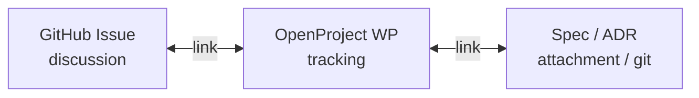

<p align="center">
  
</p>

<h1 align="center">OpenProject Bridge</h1>

<p align="center">
  <strong>GitHub ↔ OpenProject for multi-org ecosystems</strong><br>
  Bootstrap projects · webhook sync · ADR knowledge<br>
  Split layers + links — Go + OpenProject
</p>

<p align="center">
  <code>op-bootstrap</code> · <code>op-bridge</code> · <code>op-document</code>
</p>

<p align="center">
  <a href="README.md"><b>English</b></a> ·
  <a href="README.ru.md">Русский</a>
</p>

<p align="center">
  <a href="https://github.com/gloamers/openproject-bridge/actions/workflows/ci.yml"></a>
  <a href="https://codecov.io/gh/gloamers/openproject-bridge"></a>
  
  
  
  <a href="LICENSE"></a>
</p>

---

## Overview

**openproject-bridge** is a config-driven bridge between [GitHub](https://github.com/) and [OpenProject](https://www.openproject.org/) for any number of organizations (separate OP URLs, GitHub orgs, or both).

Corporate model: **discussion / tracker / durable knowledge** stay in different systems and are joined by **links** — not by mirroring issue bodies or comments. Complements (does not replace) the [official OpenProject GitHub integration](https://www.openproject.org/docs/system-admin-guide/integrations/github-integration/) (PR tab).

### Key features

| Area | What it does |
|------|----------------|
| **Bootstrap** | Multi-org YAML → idempotent parent + product OpenProject projects (`op-bootstrap`, `-dry-run`) |
| **Intake** | GitHub `issues` webhooks → work package + optional `spec.md` attachment |
| **Status** | Close / reopen → OpenProject status via `status_map` |
| **Knowledge** | Label `documented` → ADR file + GitHub comment (`op-document` CLI too) |
| **Idempotency** | HMAC-SHA256 (`X-Hub-Signature-256`) + `delivery_id` in SQLite |
| **Secrets** | Env / `*_FILE`; Keychain via `task run:bridge` |
| **Storage** | Port in `internal/storage`; default driver `storage/sqlite` |

---

## Requirements

- **Go 1.26+**
- OpenProject **API v3** (integration tests use `openproject/openproject:17`)
- A GitHub webhook secret (per-org or bridge fallback)

```bash
task build
# → bin/op-bridge  bin/op-bootstrap  bin/op-document
```

---

## Quick start

```bash
cp configs/ecosystem.example.yaml configs/ecosystem.yaml
# set openproject.url and *_env names; export those env vars

task build
./bin/op-bootstrap -config configs/ecosystem.yaml -org acme -dry-run
./bin/op-bootstrap -config configs/ecosystem.yaml -org acme
./bin/op-bridge -config configs/ecosystem.yaml -listen :8443
```

Webhook: `https://bridge.example.com/webhooks/github`  
Content-Type `application/json` · secret = env value of `secret_env` / per-org `webhook_secret_env`.

### Content layers



---

## CLI

| Binary | Role |
|--------|------|
| `op-bootstrap` | Ensure OP projects from YAML (`-dry-run`, `-org`) |
| `op-bridge` | Webhook server; `-reconcile` once |
| `op-document` | Write ADR (+ optional GH comment) for `owner/repo#n` |

```bash
./bin/op-bridge -h
./bin/op-bootstrap -h
./bin/op-document -h
```

---

## Configuration

Copy [`configs/ecosystem.example.yaml`](configs/ecosystem.example.yaml). Secrets are **never** literals in YAML — only env names.

| Kind | Source |
|------|--------|
| API keys / webhook HMAC | `OPENPROJECT_*_API_KEY`, `GITHUB_WEBHOOK_SECRET`, or `*_FILE` (absolute path) |
| Optional GitHub token | `GITHUB_TOKEN` (`op-document`, `-reconcile`) |
| Keychain | `task run:bridge -- -config configs/ecosystem.yaml` |

macOS examples:

```bash
security add-generic-password -a "$USER" -s opbridge-openproject-acme-api-key -w 'opapi-…'
security add-generic-password -a "$USER" -s opbridge-github-webhook-secret -w '…'
task run:bridge -- -config configs/ecosystem.yaml -listen :8443
```

---

## Development

Requires [Task](https://taskfile.dev/). Makefile is a thin shim (`make check` → `task check`).

```bash
task build
task test
task test:integration      # Docker OpenProject → ./tests/
task check:quick           # fmt, vet, unit
task check:no-integration  # + race, lint
task check                 # + Docker integration
```

Integration env:

| Variable | Meaning |
|----------|---------|
| `OPENPROJECT_BRIDGE_ITEST_DOCKER=1` | Start `openproject/openproject:17` |
| `OPENPROJECT_BRIDGE_ITEST_CREATE_API_KEY=1` | Create API token via rails |
| `OPENPROJECT_BRIDGE_ITEST_URL` | Or use an existing instance |
| `OPENPROJECT_BRIDGE_ITEST_API_KEY` | Existing token |

See [CONTRIBUTING.md](CONTRIBUTING.md).

---

## Deploy

Example units: [`deploy/compose.yaml`](deploy/compose.yaml), [`deploy/op-bridge.service`](deploy/op-bridge.service). Put TLS and Authelia/edge in org ops — not in this repo.

---

## Security

Webhook HMAC, secret files, and disclosure: [SECURITY.md](SECURITY.md).

---

## License

MIT — see [LICENSE](LICENSE).

---

<p align="center">
  <strong>OpenProject Bridge</strong> — discussion on GitHub, tracking on OpenProject, decisions in git
</p>
